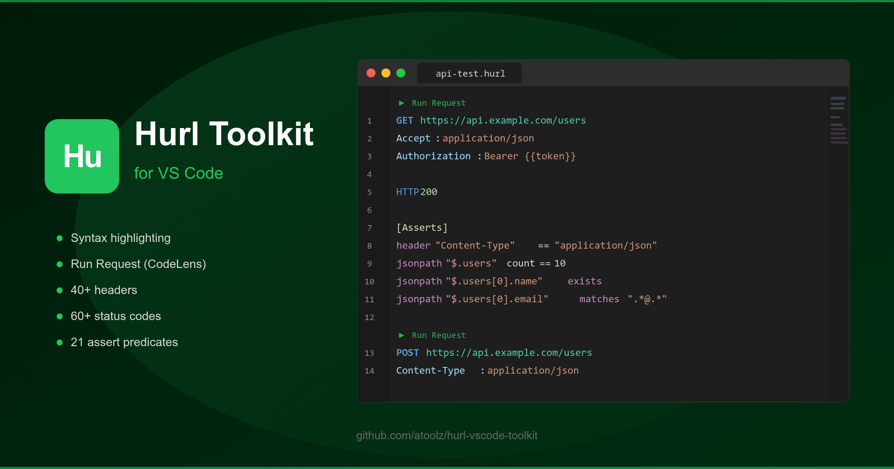
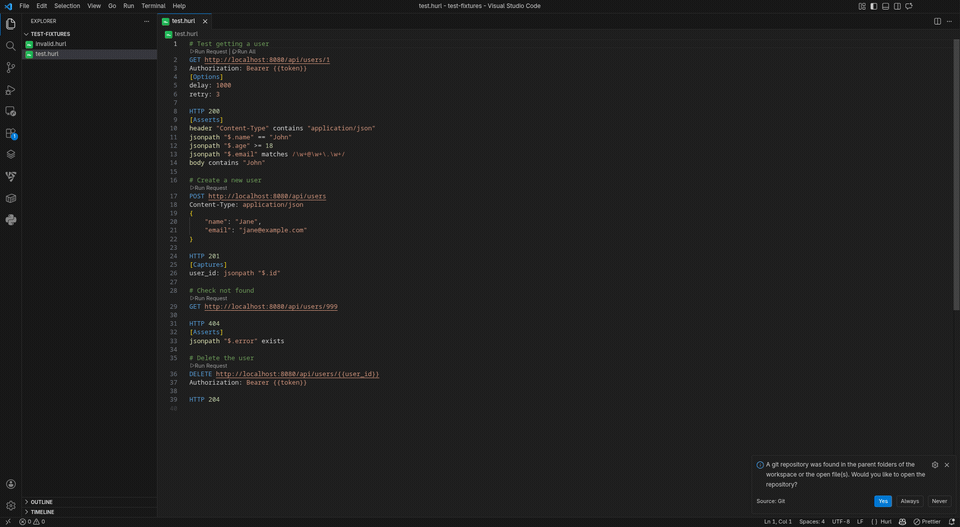
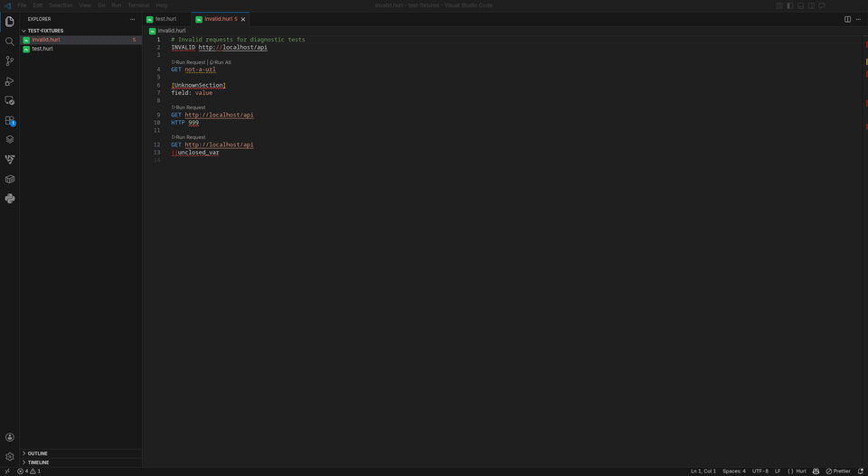

<p align="center">
  
</p>

<p align="center">
  <a href="https://marketplace.visualstudio.com/items?itemName=kratosgado.hurl-plus"></a>
  <a href="https://marketplace.visualstudio.com/items?itemName=kratosgado.hurl-plus"></a>
  <a href="https://marketplace.visualstudio.com/items?itemName=kratosgado.hurl-plus"></a>
  <a href="https://opensource.org/licenses/MIT"></a>
  <a href="https://hurl.dev"></a>
</p>

<p align="center">
  Complete <a href="https://hurl.dev">Hurl</a> HTTP testing toolkit for VS Code. Syntax highlighting, run requests, response viewer, and IntelliSense for <code>.hurl</code> files.
</p>

## Features

### Syntax Highlighting

Full TextMate grammar for `.hurl` files with support for HTTP methods, URLs, headers, status codes, sections, variables, embedded JSON/XML/GraphQL, assert predicates, filter functions, and more.

<p align="center">
  
</p>

### Run Requests (CodeLens)

Click **Run Request** above any HTTP method to execute it with `hurl`. Click **Run All** to execute every request in the file. Output is displayed in a dedicated output channel, and the optional webview panel is reused on each run instead of opening a new tab.

Keyboard shortcuts are also available in `.hurl` files:

- `Ctrl+Enter` runs the current request under the cursor
- `Ctrl+Shift+Enter` runs the entire file

### IntelliSense

Context-aware completions for:

- HTTP methods (GET, POST, PUT, PATCH, DELETE, HEAD, OPTIONS, CONNECT, TRACE)
- Common HTTP headers with value suggestions (Content-Type, Authorization, Accept, etc.)
- Section names ([Asserts], [Captures], [Options], [FormParams], etc.)
- HTTP status codes with descriptions (200 OK, 404 Not Found, 500 Internal Server Error, etc.)
- Assert predicates (==, !=, >, contains, matches, exists, isString, etc.)
- Filter functions (count, jsonpath, regex, replace, split, toInt, etc.)
- Options (delay, retry, location, insecure, verbose, etc.)
- Variable references ({{variable}}) from captures and usage


### Notebook View

Open any `.hurl` file as a VS Code notebook by right-clicking it in the Explorer and selecting **Hurl: Open as Notebook**, clicking the notebook icon in the editor title bar, or running the command from the palette.

Each HTTP request becomes an executable cell. Click the run button on a cell (or use **Run All**) to execute it with hurl. Results render inline as markdown:

- Status line (`HTTP/1.1 200 OK`)
- Collapsible response headers block
- Formatted JSON body (or raw body for other content types)
- Assertion error details when a request fails

The active environment profile is respected, so all variables, CLI arguments, and environment variables defined in your profile apply to notebook runs. The `.hurl` file is kept in its original text format on disk — the notebook view is just an alternate editor.

### Hover Documentation

Hover over any keyword to see documentation. Methods, status codes, sections, options, assert predicates, filter functions, and headers all provide contextual information.

<p align="center">
  
</p>

### Diagnostics

Real-time error detection for:

- Invalid HTTP methods
- Malformed URLs
- Unknown section names
- Invalid status codes (outside 100-599 range)
- Unclosed variable references `{{`

<p align="center">
  
</p>

### Snippets

9 built-in snippets for common Hurl patterns:

| Prefix           | Description                        |
| ---------------- | ---------------------------------- |
| `hurl-get`       | Basic request with asserts         |
| `hurl-post-json` | POST JSON request with capture     |
| `hurl-post-form` | POST form request                  |
| `hurl-vars`      | Request with scoped variables      |
| `hurl-capture`   | Capture and reuse a response value |
| `hurl-redirect`  | Redirect flow with assertions      |
| `hurl-upload`    | Multipart upload                   |
| `hurl-graphql`   | GraphQL request                    |
| `hurl-full`      | Full CRUD flow                     |

## Requirements

- [Hurl](https://hurl.dev/docs/installation.html) installed and available in your PATH (or configured via settings)

## Extension Settings

| Setting                                 | Default  | Description                                                                                                     |
| --------------------------------------- | -------- | --------------------------------------------------------------------------------------------------------------- |
| `hurl-plus.hurlPath`                 | `"hurl"` | Path to the hurl executable                                                                                     |
| `hurl-plus.showResponseInWebview`    | `false`  | Show responses in a webview panel                                                                               |
| `hurl-plus.additionalArguments`      | `""`     | Extra arguments passed to hurl                                                                                  |
| `hurl-plus.variablesFile`            | `""`     | Path to a `--variables-file` for hurl                                                                           |
| `hurl-plus.activeEnvironmentProfile` | `""`     | Default named environment profile to use for runs                                                               |
| `hurl-plus.environmentProfiles`      | `{}`     | Named profiles with `hurlPath`, `variablesFile`, `additionalArguments`, `variables`, and `environmentVariables` |

## Environment Profiles

Environment profiles let you keep local, staging, and production run settings separate while still using the same `.hurl` files.

Each profile can override the Hurl executable, add `--variables-file`, append extra CLI arguments, define template variables with `--variable name=value`, and inject process environment variables such as `HURL_INSECURE` or `HURL_VERBOSE`.

Use the status bar item labeled `Hurl: ...` or run `Hurl: Select Environment` to switch profiles. `Hurl: Clear Environment` falls back to the default global settings and inherited shell environment. You can also set `hurl-plus.activeEnvironmentProfile` to choose the default profile when Hurl runs.

## About Hurl

[Hurl](https://hurl.dev) is a command-line tool that runs HTTP requests defined in a simple plain text format. It can perform requests, capture values, and evaluate queries on headers and body response. Hurl is very versatile: it can be used for fetching data, testing HTTP sessions, and testing APIs.

## Contributing

```bash
git clone https://github.com/kratosgado/hurl-plus.git
cd hurl-plus
npm install
npm run build
npm run test:e2e
# Press F5 in VS Code to debug
```

Contributions welcome! See the [AToolZ Contributing Guide](https://github.com/kratosgado/.github/blob/main/CONTRIBUTING.md).

## License

[MIT](LICENSE)

<p align="center"><sub>Part of the <a href="https://github.com/kratosgado">AToolZ</a> toolkit suite</sub></p>
